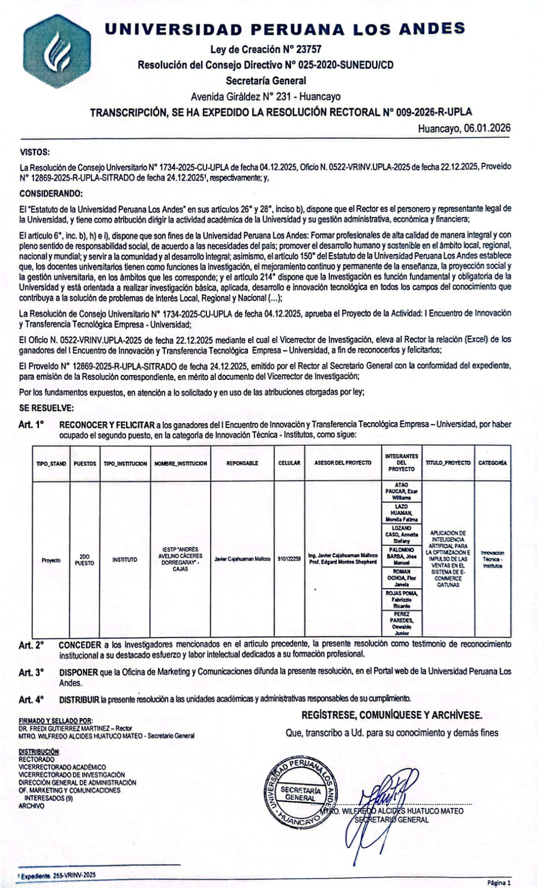
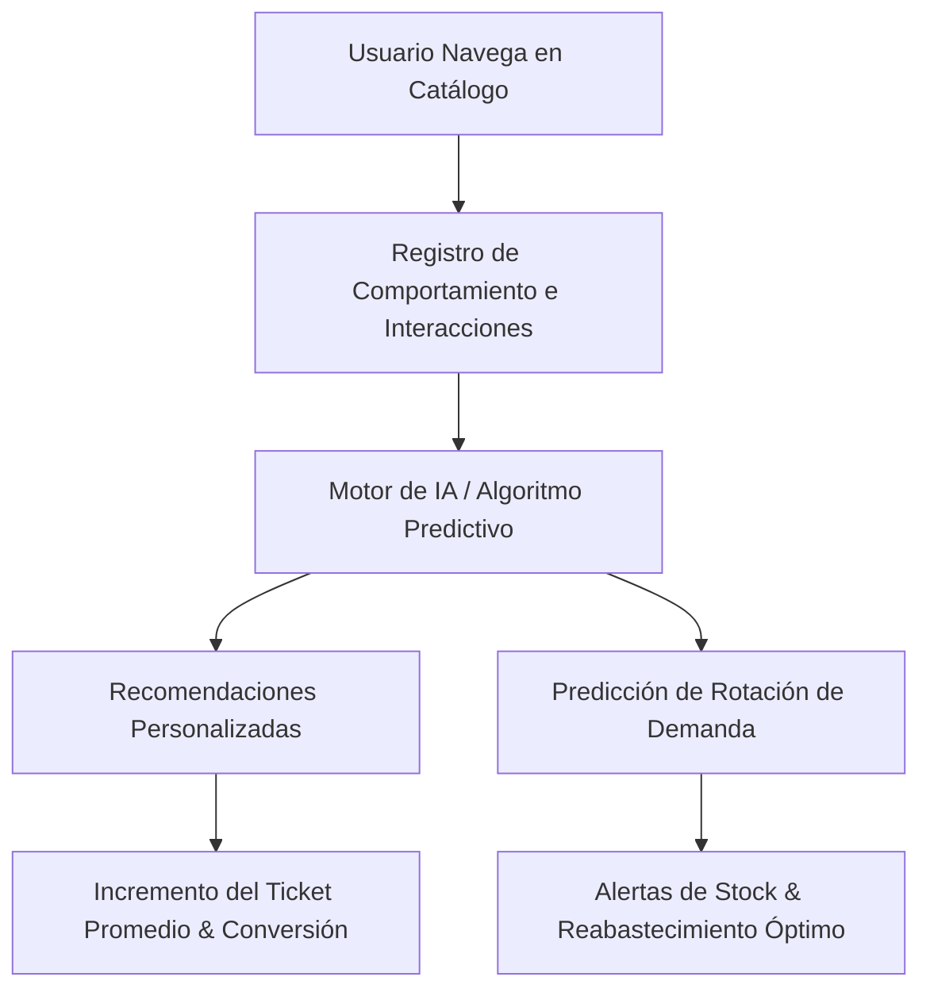

# 🧠 QATUNAS — Sistema de E-Commerce con Inteligencia Artificial

  <strong>"Aplicación de Inteligencia Artificial para la Optimización e Impulso de las Ventas en el Sistema de E-Commerce QATUNAS"</strong>

---

## 📜 Resolución Rectoral Oficial — UPLA 2026

  
    
  📄 <strong>Resolución Rectoral Nº 009-2026-R-UPLA</strong> emitida por la Universidad Peruana Los Andes (06 de Enero de 2026)

---

## 📌 Descripción del Proyecto

**QATUNAS** es una plataforma de comercio electrónico diseñada para pequeñas y medianas empresas comerciales, orientada a maximizar la conversión y optimizar la rotación de inventarios mediante la integración de **algoritmos predictivos y modelos de Inteligencia Artificial**.

El proyecto fue presentado y galardonado con el **2do Puesto en Innovación Técnica** en el *I Encuentro de Innovación y Transferencia Tecnológica Empresa – Universidad*, recibiendo el reconocimiento oficial mediante la **Resolución Rectoral Nº 009-2026-R-UPLA** emitida por la **Universidad Peruana Los Andes (UPLA)** en conjunto con el **IESTP "Andrés Avelino Cáceres Dorregaray"**.

---

## 🚀 Características & Módulos con Inteligencia Artificial

### 1. 🎯 Motor de Recomendación Inteligente (Recommendation Engine)
* Análisis de patrones de navegación, categorías más visitadas y productos complementarios.
* Sugerencias dinámicas en tiempo real en la página de producto y en el carrito de compras (*Cross-selling y Up-selling*).

### 2. 📈 Predicción de Demanda & Gestión de Inventarios
* Estimación de la rotación de productos basada en tendencias temporales y volumen histórico de ventas.
* Detección temprana de productos de baja rotación para generación de promociones dirigidas.

### 3. 🛒 Optimización del Proceso de Checkout (CRO)
* Flujo de compra simplificado para minimizar la tasa de carritos abandonados.
* Integración de pasarelas de pago y validación segura de pedidos.

---

## 🛠️ Arquitectura Tecnológica

| Componente | Tecnologías Empleadas |
| :--- | :--- |
| **Frontend Web** | HTML5 Semántico, CSS3 Moderno, JavaScript ES6+, UI Responsiva |
| **Backend & APIs** | PHP con arquitectura PDO, POO y servicios RESTful en JSON |
| **Base de Datos** | MySQL Relacional (Esquema optimizado para catálogos, pedidos y logs) |
| **Lógica de IA** | Modelado estadístico y heurísticas para scoring y predicción de ventas |
| **Herramientas** | Git, GitHub, phpMyAdmin, Linux, Postman |

---

## 🏆 Distinción Institucional & Reconocimiento Oficial

* **Evento:** *I Encuentro de Innovación y Transferencia Tecnológica Empresa – Universidad*
* **Entidad Otorgante:** Universidad Peruana Los Andes (UPLA) — Rectorado y Vicerrectorado de Investigación.
* **Institución Participante:** IESTP "Andrés Avelino Cáceres Dorregaray" (San Agustín de Cajas, Huancayo).
* **Documento Oficial:** **Resolución Rectoral Nº 009-2026-R-UPLA** *(Huancayo, 06 de Enero de 2026)*.
* **Premio:** **2do Puesto en Innovación Técnica**.

---

## 👨‍💻 Integrante & Desarrollador

* **Exar Williams Atao Paucar**
* 🌐 GitHub: [@Diancy01](https://github.com/Diancy01)
* ✉️ Contacto: `williamsatao1@gmail.com`
* 📍 Huancayo, Junín, Perú

---

  ⭐️ Proyecto de Innovación Tecnológica desarrollado con pasión por el código limpio y la investigación aplicada.

